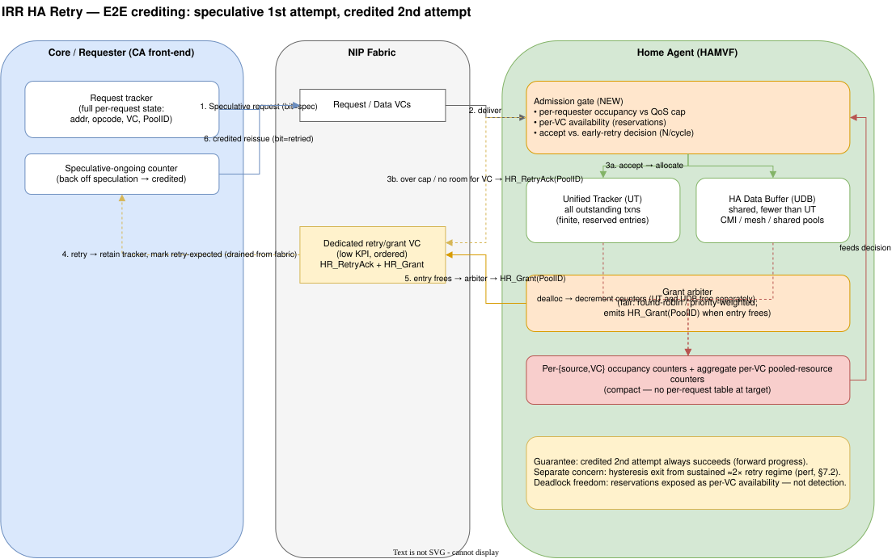

# IRR HA Retry — Hardware Architecture Specification

**Document:** IRR_HA_retry
**Revision:** 0.1 (DRAFT — for discussion, not approved architecture)
**Date:** 2026-09-17
**Scope:** End-to-end retry-based flow control for Home Agent (HA) traffic on IRR

> **AI-generated content disclaimer.** Substantial portions of this document were
> drafted with AI assistance. Content may contain errors, omissions, or
> misinterpretations of the referenced specifications and has **not** been fully
> verified. Treat all statements — especially those attributed to public HAS
> sources — as **unverified** until independently confirmed against the
> authoritative specifications and reviewed by the responsible architects. This
> is a discussion draft, not approved architecture.

---

## 1. Introduction & Conventions

### 1.1 Purpose

This document specifies an **end-to-end (E2E) retry-based flow-control**
architecture for Home Agent traffic on Iron Rapids (IRR). It defines the
responsibilities of the cores (the true request sources), the shared **Core-side
CA / requester front-end** that distributes credit and arbitration, the **Fabric**
(NIP-based interconnect), and the **Home Agent** (HA, as implemented by the
HAMVF IP). The architecture separates:

- the **full request state** retained at the requester side (owned by the cores /
  logical requesters), and
- the **aggregate pressure / grant state** tracked at the target side (HA).

This separation is intentional: the cores hold the exact pending-request metadata
needed to reissue a rejected transaction; the CA is a shared core-side
coordinator for scheduling and credit accounting, not the owner of every request
in flight.

Retry allows a target that cannot currently accept a request to *reject* it
("retry it") rather than buffer it in the interconnect. The rejected request is
drained from the fabric and later reissued by the source once the target signals
it is ready. This trades interconnect buffering/pressure for endpoint tracking
complexity.

**Domain-generality.** Although this document develops the mechanism in the
HAMVF (HA) ↔ CBB (requester) context, the scheme is a **general** shared-resource
flow-control primitive. It applies to *any* pair of endpoints that share a
finite, allocate-and-held tracking resource behind a fabric — e.g. the HA
UT/UDB (this document), the uncore Table of Requests (ToR, §3.7), and the
intra-CBB L2↔L3 path (under consideration separately). Nothing in the core
mechanism (speculative first attempt, target-side retry, grant-gated credited
reissue, per-`{source,VC}` accounting) is specific to HAMVF.

**Framing: this is fundamentally E2E crediting.** The mechanism is best understood
as an **end-to-end crediting** scheme with a **speculative first attempt** and a
**credited second attempt**. The first issue is sent speculatively (no credit
held); if the target cannot accept it, the target retries it and later returns a
credit (grant); the source then reissues, credited, and is **guaranteed to
succeed on this second attempt**. This framing matters for terminology (§7) and
for the per-message speculative/retried distinction (§4.2).

### 1.2 Rationale (why retry)

1. **Interconnect pressure reduction.** Retryable messages are drained from the
   interconnect; their VC becomes "invisible" to the interconnect, enabling
   simpler dedicated per-VC buffering (cf. adaptive buffering / VNA in UPI/UXI
   links). This is **all-or-nothing per VC**: a single non-retryable message
   class keeps the whole VC visible.
2. **Congestion clog minimization.** Messages participating in a congestion
   event are not held in the fabric for long, preserving fabric availability.
   Cost: retried messages are issued twice (≈2× throughput for retried traffic).
3. **Push-to-pull deadlock avoidance.** Retry maximizes interoperability between
   push- and pull-style protocols; this is the primary justification for making
   *data* messages retryable despite the buffering cost.
4. **Fine-grain, scalable E2E QoS.** Per-source(+VC) occupancy tracking enables
   selective throttling and anti-starvation — the primary motivation for this
   specification.

### 1.3 Relationship to CHI E2E

This architecture borrows the **grant-gated retry** discipline of ARM AMBA CHI's
end-to-end flow control. The mapping is summarized in §6 and cross-referenced
throughout. Where a CHI primitive maps cleanly, the CHI name is cited. Where IRR
needs behavior CHI does not express, a **new** IRR name is introduced and its
nearest CHI relative is noted explicitly.

### 1.4 Terminology

| Term | Meaning |
|------|---------|
| Core / requester source | The true owner of a request and the owner of the full retry state. Each core or logical requester tracks its own outstanding requests. |
| CA | Shared core-side coordination / credit-distribution front-end used by the requesters. It may arbitrate among cores and manage aggregate per-core pressure, but it does not own the full per-request state for every transaction. |
| HA | Home Agent (HAMVF IP) servicing requests (the "target"). |
| Fabric / NIP | On-die interconnect carrying messages (NIP 2.0, no BRIDGE IP for HAMVF). |
| VC | Virtual Channel (independent flow-control/ordering domain). |
| Retryable message | A message the target may reject; the requester retains reissue state until the message is reissued. |
| Grant | Target→source signal authorizing reissue of a retried message (see §4.3). |
| Occupancy | Count of outstanding transactions from a source at a target. |

### 1.5 Conventions

- Spec issues are filed as tracker items, not inline comments (per HAS convention).
- **New IRR message/signal names are prefixed `HR_`** (HA-Retry) to distinguish
  them from inherited UXI/NIP/CHI names.
- Requirement keywords (**shall**, **should**, **may**) follow RFC 2119 intent.

### 1.6 Related public HAMVF evidence (baseline for IRR design)

This IRR design is grounded in the public HAMVF specification language, not only
in the abstract retry model. The most relevant public references are:

- `SCF_GEN4p1_GEN4p6_GEN4p7_HAMVF_HAS` — Unified Tracker Management:
  https://docs.intel.com/documents/iparch/scf/HAS/Gen4.1/HAS/HAMVF/SCF_GEN4p1_HAMVF_HAS.html#unified-tracker-management
- `SCF_GEN4p1_GEN4p6_GEN4p7_HAMVF_HAS` — HAMVF Data Buffer Management:
  https://docs.intel.com/documents/iparch/scf/HAS/Gen4.1/HAS/HAMVF/SCF_GEN4p1_HAMVF_HAS.html#hamvf-data-buffer-management
- `SCF_GEN4p1_GEN4p6_GEN4p7_HAMVF_HAS` — HAMVF Resource Selection for Push Requests:
  https://docs.intel.com/documents/iparch/scf/HAS/Gen4.1/HAS/HAMVF/SCF_GEN4p1_HAMVF_HAS.html#hamvf-resource-selection-for-push-requests
- `SCF_GEN4_R2204_HAMVF_HAS` — `Unified Tracker Management` and associated tracker/data-buffer resource accounting:
  https://docs.intel.com/documents/iparch/scf/HAS/Gen4/HAS/HAMVF/R2204/HAS/SCF_GEN4_R2204_HAMVF_HAS.html

The relevant public HAMVF language states that HAMVF tracks all outstanding UXI
transactions in a **Unified Tracker (UT)** and that its data buffer is a **shared,
finite resource** with dedicated pools and a shared pool for streaming traffic.
The `UT`/data-buffer management is therefore the closest public architectural
analog to the internal target-side shared request tracking and shared data-buffer
resource that the IRR retry design models as the real owner of the target-side
pressure state.

This is important for IRR: a request that is still waiting on coherence
resolution or a pending response is not merely "in flight" at the NIP; it remains
allocated in a shared target-side tracker/data-buffer resource until the
coherency event is resolved. That is precisely the reason a target-side retry
decision must factor both **capacity** and **fairness/occupancy**.

---

## 2. Architectural Overview

### 2.1 Retry lifecycle

> Editable source for all figures: [assets/irr_ha_retry.drawio](assets/irr_ha_retry.drawio)
> (draw.io; page 1 = mechanism, page 2 = bottleneck vs fix).

**Figure 1 — E2E crediting: speculative first attempt, credited second attempt.**



<details>
<summary>Plain-text lifecycle (same flow)</summary>

```
  Core requester / CA front-end  Fabric (NIP)                 HA (HAMVF)
     |                                 |                            |
     |  1. Request (speculative)       |                            |
     |------------------------->|--------------------------->|
     |                          |          2. Cannot accept  |
     |                          |             (no resource / |
     |                          |              QoS throttle) |
     |   3. HR_RetryAck(PoolID) |                            |
     |<-------------------------|<---------------------------|
     |  (drop req from fabric;  |                            |
     |   retain tracker;        |                            |
     |   mark "retry expected") |                            |
     |                          |                            |
     |         ... time passes; congestion clears ...        |
     |                          |                            |
     |   4. HR_Grant(PoolID)    |                            |
     |<-------------------------|<---------------------------|
     |                          |                            |
     |  5. Reissue Request      |                            |
     |------------------------->|--------------------------->|
     |                          |            6. Accept, proc |
     |   7. Cmp* / Data         |                            |
     |<-------------------------|<---------------------------|
```

</details>

### 2.2 Key principles

- **P1 — Grant-gated reissue.** A retried request **shall not** be reissued
  until the source receives an explicit `HR_Grant` for its pool. The source
  **shall not** spin-retry. (Mirrors CHI RetryAck→PCrdGrant→reissue.)
- **P2 — Per-VC independence.** Retry accounting is maintained per
  `{peer, VC}`; congestion in one VC **shall not** trip another VC's retry
  decision.
- **P3 — Bounded reissue.** Outstanding reissues from a source are bounded by
  the number of grants the target has emitted, so the target paces recovery.
- **P4 — Two guarantees, kept separate.** (a) *Forward progress:* every request
  succeeds on its **credited second attempt** (inherent to E2E crediting). (b)
  *Retry-regime exit:* the system **shall** provably leave a sustained ≈2×
  two-attempt regime after congestion clears, via hysteresis (§7.2). These are a
  correctness and a performance guarantee respectively — not the same thing.
- **P5 — Occupancy-based QoS.** The retry/accept decision **may** use per-source
  occupancy and message priority to enforce fairness and anti-starvation (§5).

### 2.3 Baseline: how HAMVF UT / HA data buffer works today (and why it bottlenecks)

This section describes the **current** HAMVF resource model (no retry) so the
IRR proposal can be contrasted against it. See public HAMVF HAS §1.6 references
(Unified Tracker Management, HAMVF Data Buffer Management, Resource Selection for
Push Requests).

**2.3.1 Unified Tracker (UT).** HAMVF tracks **all** outstanding transactions it
is processing in a single **Unified Tracker**. A UT entry is allocated when a
coherent transaction is admitted and held for the **entire lifetime** of that
transaction — through snoop (HSF lookup + snoop to IACA/IOCA), coherence
resolution, the memory access over CMI, and the response/data return. The UT
holds the per-transaction state: requester identity (CNID; IACA vs IOCA vs CBB
allocation), opcode class (UXI REQ DDIO vs non-DDIO, CXL.mem M2S REQ/RwD/BISnp,
UXI writeback), target memory region (1LM DDR, mirrored, Flat2LM, CXL), and
coherence/pipeline progress. UT entries are a **finite** resource with reserved
entries set aside to guarantee forward progress and deadlock freedom.

**2.3.2 HA data buffer (UDB).** HAMVF has **fewer data buffers than tracker
entries**, so transactions that move data must *share* the data-buffer pool. The
HAS divides the data buffer into a **CMI pool**, a **mesh pool**, and a **shared
pool**; the shared pool is what allows either co-located memory traffic *or* DDIO
to stream at full bandwidth — but **not both simultaneously at full rate**. A
coherent IO transaction (e.g. a DDIO read that hits a core's L2, or any transfer
that must stage data) must **obtain and hold a data-buffer entry** from the time
it is admitted until the data movement and snoop/response are complete.

**2.3.3 Allocate-and-hold = the glass jaw.** The key property is that both the UT
entry and the data-buffer entry are **held for the full outstanding duration**,
including the slow part — waiting for the snoop response from a core's L2. When
L2-sourced data is involved, the per-transaction *hold time* is long, so entries
drain slowly:

- The shared data-buffer pool has a **fixed capacity**; L2-hit servicing is itself
  limited (≈30 GB/s in the sighting).
- A single agent streaming L2-sourced coherent traffic can occupy a large share of
  the shared data buffer for a long time per entry.
- Because admission is **first-come / no per-requester fairness**, other agents'
  unrelated coherent transactions **cannot acquire an entry** and stall behind the
  congested agent — classic **head-of-line blocking**.
- Net effect: the aggregate DDIO / coherent-IO bandwidth seen by *all* agents
  collapses toward the single slow agent's rate, even when the other agents are
  targeting memory and would not otherwise be limited.

**2.3.4 Why "more entries" is not the fix.** Increasing UT/UDB depth raises the
ceiling but does **not** remove the failure mode: with no QoS/fairness arbitration
on allocation, one agent can still monopolize whatever shared capacity exists and
re-create the same head-of-line blocking at a higher absolute occupancy. The root
gap is the **absence of a per-requester admission/fairness mechanism** in front of
the shared UT/UDB resource — not raw capacity. This is the specific gap the IRR
retry design targets (§3.3, §5).

**Figure 2 — Shared UT/UDB bottleneck (baseline) vs. per-requester fairness gate (IRR).**


---

## 3. Agent Responsibilities

### 3.1 Core-side requesters — what must change

The true request sources are the cores (or logical requester instances behind the
cores). The **full request state** of a rejected transaction is owned by the
requester-side tracker, not by a single shared CA table. The CA is a shared
core-side coordination structure for arbitration and credit distribution, but it
is not the owner of every per-request entry.

The retry feature adds the following requester-side responsibilities:

**3.1.1 Speculative issue.** A core-side requester **may** issue a request
without holding a pre-allocated target credit (unlike a pure credit scheme).
Related CHI behavior: CHI Requesters may send without a P-Credit and handle
RetryAck.

**3.1.2 Retry-aware tracker retention.** On receiving `HR_RetryAck` for an
outstanding request, the requester's tracker **shall**:
- retain the request's full tracker entry and all reissue state (address, opcode,
  VC, ordering metadata, and the returned `PoolID`);
- treat the request as *not in fabric* (drained) but *not complete*;
- hold the transaction until an `HR_Grant` for the relevant pool allows reissue;
- keep the corresponding per-target `retry-expected` accounting (§5.1).

**3.1.3 Grant-gated reissue.** On receiving `HR_Grant(PoolID)`, the requester
**shall** reissue exactly one retried request matching that pool. If the
requester has multiple retried requests for the pool, selection **should** be
age-ordered to bound latency and prevent starvation.

**3.1.4 Grant/credit reconciliation.** Because grants and normal credit returns
may arrive out of order relative to retries (§4.4), each requester **shall**
maintain the counters of §5.1 to reconcile "grant received but retry not yet
reissued" vs. "retry outstanding but grant not yet received."

**3.1.5 Data-message retry (optional, push-to-pull).** For retryable *data*
(write/WB) messages, the requester **shall** retain the data payload (or a
re-fetchable handle) until the grant-gated reissue completes. Buffering cost is
bounded and comparable to a pull protocol's (see §7.3). Related CHI: write retry
with DataPull-style semantics; **IRR extends** this to arbitrary data VCs.

**3.1.6 CA is not the request owner.** The shared CA **shall not** be treated as
an authoritative owner of the full request state for every rejected transaction.
Its role is to mediate core-side scheduling, fairness, and aggregate grant
accounting; the cores retain transaction-level retry state and the reissue
responsibility.

### 3.2 Fabric (NIP interconnect) — what must do

The NIP fabric is **not** the retry decision-maker; retry is an endpoint (CA/HA)
function. The fabric's obligations:

**3.2.1 Retry/grant VC transport.** The retry (reject) message `HR_RetryAck`
**shall** travel on its **own dedicated fabric VC**. This is not strictly
mandatory, but it is the **simple and safe** choice: a retry message must never be
blocked behind traffic that is itself subject to congestion/retry, or a
dependency loop can form. Because retry events are relatively infrequent and
small, the performance (bandwidth) requirement for this VC is **low**, so a
dedicated VC is cheap.

The grant (credit-return) message `HR_Grant` is **drainable** (it always makes
forward progress and is consumed at the source without needing a scarce
downstream resource), so it does **not** by itself require a dedicated VC and
*could* share with other drainable messages. In practice, however, IRR **places
both `HR_RetryAck` and `HR_Grant` on the same dedicated low-KPI VC**. Doing so
opens an opportunity to **keep retry and grant ordered** relative to each other
(see §4.4), which can eliminate endpoint reconciliation counters. Both are carried
using existing NIP response routing (HNID/HTID-style, cf. HAMVF §8.10.7).

**3.2.2 Draining, not buffering.** When a request is retried, the fabric holds no
residual state — the request has already been delivered to the HA and
`HR_RetryAck` returned. The fabric **shall not** be required to replay or buffer
retried requests. This is the source of the interconnect-pressure benefit (§1.2).

**3.2.3 Retryable-VC invisibility (optimization).** For VCs in which *all*
message classes are retryable, the fabric **may** reduce shared adaptive buffering
to dedicated per-VC buffering (§1.2 benefit 1). The fabric **shall** expose which
VCs qualify via configuration; mixing a non-retryable class into such a VC is a
misconfiguration (§8).

**3.2.4 Ordering on the shared retry/grant VC (opportunity).** Because
`HR_RetryAck` and `HR_Grant` share one dedicated VC (§3.2.1), the fabric **may**
preserve their mutual order cheaply. If that order is guaranteed, the endpoint
reconciliation counters of §5.1 can be **reduced or eliminated** (§4.4). Absent
such a guarantee, reconciliation remains an endpoint responsibility (§3.1.4,
§4.4). Either way the fabric needs no new *global* ordering across unrelated
VCs.

**3.2.5 Congestion-internal caveat.** Retry addresses endpoint-induced
congestion. Congestion *inside* the fabric is not resolved by this mechanism
(only endpoints trigger retry); see open issue OI-3.

### 3.3 Home Agent (HAMVF) — what must do

The HA is the retry **decision point** and the grant **issuer**.

**3.3.1 Retry-decision logic (high throughput).** On each incoming request the HA
**shall** decide accept vs. retry. This decision **should** operate at up to the
peak arrival rate (N/cycle), which may exceed the HA's processing rate (1/cycle),
so the fabric can be drained faster than steady-state processing (§1.2 benefit 2).
Related HAMVF context: early-completion response generation (HAMVF §8.10.23) and
the existing "trash-and-retry" DRS/NDR deadlock breaker (HAMVF §8.10.28.1), which
is a narrow precedent for HA-initiated retry.

**3.3.2 Retry causes.** The HA **shall** retry a request when any of:
- the resource is not available **for that request's VC** (§3.3.8) — resource
  exhaustion as seen through per-VC availability;
- per-source occupancy exceeds its QoS cap (§5.2) — *early retry*.

**3.3.3 Pool identification.** Each `HR_RetryAck` **shall** carry a `PoolID`
identifying which resource pool the source must be granted before reissue.
Related CHI: `PCrdType`. **IRR difference:** pools **may** be defined per
`{resource-class, VC}` rather than CHI's per-transaction-class only (§6).

**3.3.4 Grant generation.** When a pooled resource becomes available the HA
**shall** emit `HR_Grant(PoolID)` to a source with an outstanding retry for that
pool. Grant issuance order across waiting sources **shall** be arbitrated for
fairness/anti-starvation (round-robin or priority-weighted; §5.2). Related CHI:
`PCrdGrant`.

**3.3.5 Occupancy & reconciliation counters.** The HA **shall** maintain the
per-source(+VC) counters of §5.2, including the aggregate pooled-resource
counter that gates *whether* any request can be accepted, plus the per-source
occupancy that gates *which* source is admitted/throttled.

This is consistent with the public HAMVF HAS language describing a **Unified
Tracker (UT)** and shared **data-buffer** accounting within HAMVF. In the public
HAMVF architecture, the tracker and data-buffer resources are finite and shared,
which means the target-side occupancy state is not just a local queue of
requests; it is a global admission gate that must be managed across multiple
in-flight transactions and multiple sources. The IRR design treats this as the
real target-side pressure state that drives early retry and fairness throttling.

**3.3.6 Forward progress & retry-regime exit.** Two *distinct* guarantees are
required (see §7 for the precise distinction):
- **Forward progress (general):** every retried request is **guaranteed to
  succeed on its credited second attempt** — this is inherent to the E2E crediting
  model and does **not** require a special mechanism.
- **Retry-regime exit (performance):** the HA **shall** implement the hysteresis
  mechanism of §7.2 so the system leaves a sustained "two-attempt" (≈2×) regime
  once congestion clears. This is a performance guarantee, not a correctness one.

**3.3.7 Grant loss / robustness.** A lost `HR_Grant` must not deadlock a source
forever. The HA **shall** support a reconciliation/timeout path (see OI-2).

**3.3.8 No deadlock *detection* at the HA — deadlock avoidance is by reservation.**
The HA does **not** implement deadlock detection or a special "forced retry for
deadlock" case. Instead, HA resources carry the necessary **reservations** so that
deadlock cannot occur. These reservations are exposed to the retry mechanism as
**per-VC availability**: the *same* physical resource may appear **available to
one VC and unavailable to another**, depending on what is reserved for each VC.
Consequently, "is there room?" is always a **per-VC** question (not a single
global free count), and this per-VC availability is precisely what guarantees
deadlock freedom. This is why per-VC tracking is **mandatory**, not optional
(§5.2, §5.3).

### 3.4 How the IRR design fixes the UT / HA data-buffer bottleneck

This section maps the mechanism of §3.1–§3.3 directly onto the baseline failure
mode described in §2.3 (allocate-and-hold of UT/UDB entries with no per-requester
fairness → head-of-line blocking → aggregate DDIO/coherent-IO collapse).

**3.4.1 Add a lightweight admission gate in front of UT/UDB.** Today a
transaction allocates a UT entry (and, if it moves data, a shared data-buffer
entry) the moment it is admitted, and holds it through the slow snoop/response
path (§2.3.3). IRR inserts a **pre-allocation admission check** at the HA: before
a request is allowed to consume a UT/UDB entry, the HA evaluates **per-requester
occupancy** against a QoS cap (§5.2). If the requester is already over its fair
share of the shared pool, the request is **retried** (`HR_RetryAck`) instead of
being admitted. This keeps the shared UT/UDB pool from being monopolized by one
congested agent.

**3.4.2 Per-requester accounting, not per-request target state.** The HA does
**not** need to keep full per-request state to do this. It keeps a **compact
per-requester (per `{source, VC}`) occupancy counter** plus a small number of
**aggregate pooled-resource counters** for the shared UT and data-buffer pools
(§5.2, §5.3). The full reissue state (address, opcode, data handle) stays at the
requester (§3.1.2, §3.1.5). This is the key cost argument: the target gains
fairness **without** a per-request table scaling with outstanding transactions.

**3.4.3 Separate the "slow-hold" class so it cannot block others.** The dominant
pathology is L2-sourced data that holds a **shared data-buffer** entry for a long
time (§2.3.3). IRR lets the data-buffer pool be partitioned into retry pools via
`PoolID` (§3.3.3), so the long-hold DDIO/L2-sourced class draws from a bounded
pool. When that pool is exhausted, only **that class** is retried; unrelated
coherent transactions (e.g. reads targeting memory) draw from a different pool and
**continue to make progress**. This directly removes the head-of-line blocking of
§2.3.3.

**3.4.4 Grant-gated recovery targets the right requester.** When a UT/UDB entry
frees up, the HA issues `HR_Grant(PoolID)` to a **specific** waiting requester,
chosen by fair arbitration (round-robin or priority-weighted; §3.3.4, §5.2).
Because reissue is grant-gated (P1/P3), the congested agent cannot immediately
re-grab all freed capacity; the HA **paces** who recovers, so bandwidth is
redistributed fairly across agents instead of collapsing to the slowest one.

**3.4.5 Drain pressure off the interconnect while blocked.** Because a retried
request is **drained** from the fabric (§3.2.2) rather than back-pressured in
place, a congested requester waiting on UT/UDB capacity does **not** hold NIP
buffering and does **not** stall unrelated VCs in the interconnect (§1.2
benefit 1). The waiting state lives as a cheap counter at the endpoints, not as
occupied fabric/queue slots.

**3.4.6 Why this scales where "more entries" does not.** Growing UT/UDB depth
alone raises the ceiling but preserves monopolization (§2.3.4). The IRR gate makes
the shared pool **fairness-managed**: the per-requester cap bounds any single
agent's share, `PoolID` isolation protects the long-hold class, and grant
arbitration controls recovery order. The result is that aggregate DDIO/coherent-IO
throughput is governed by **fair sharing of the shared resource**, not by the
single most-congested agent.

**3.4.7 Applicability beyond DDIO.** The same gate applies to any HAMVF-tracked
coherent transaction — including cross-CBB coherent accesses and non-DDIO modes
(IOLLC allocation, persistent-memory mode) — because they all allocate UT (and,
when they stage data, UDB) entries (§2.3.1–§2.3.2). The fairness gate therefore
addresses the broader shared-resource contention, not only the DDIO benchmark
that first exposed it.

### 3.5 Implementation scope — what changes vs. what stays

A deliberate goal of this design is to be **additive**: the scarce target-side
structures (UT, HA data buffer) and the source-side request tracker are **not**
redesigned. The scheme is primarily a per-requester accounting + admission/grant
block placed **in front of** UT/UDB allocation, plus the new retry protocol
messages.

**3.5.1 New logic (in front of UT/UDB).**
- A compact **per-requester occupancy** structure, indexed per `{source, VC}`
  (counters only — no per-request records). See §5.2–§5.3.
- A small set of **aggregate pooled-resource counters** mirroring free UT entries
  and free data-buffer entries per `PoolID`.
- An **admission / QoS comparator** that decides accept vs. early-retry *before*
  an entry is allocated (§3.3.2).
- **Grant arbitration** that selects which waiting requester is granted when an
  entry frees (§3.3.4).

**3.5.2 Hooks into existing HAMVF logic (unavoidable, but small).**
- **Dealloc/free taps.** Per-requester and aggregate counters **shall** decrement
  on the existing UT/UDB **retire/deallocation** events — so the new block sees
  both allocation and release.
- **Pool-aware allocation.** Allocation **shall** be `PoolID`-aware so the
  long-hold class (DDIO / L2-sourced) draws from a bounded pool. This **extends**
  the existing CMI/mesh/shared data-buffer partitioning (§2.3.2) rather than
  introducing a new structure.
- **HA egress for new messages.** The HA **shall** generate `HR_RetryAck` and
  `HR_Grant` (§4) on existing NIP response paths.

**3.5.3 New protocol (endpoints only, fabric unchanged).**
- The new `HR_RetryAck` / `HR_Grant` messages and the grant-gated reissue
  discipline (§4, P1/P3) are the protocol additions.
- They are carried as **response-class messages over existing NIP routing**
  (§3.2.1); the fabric itself needs **no** new transport or ordering guarantees
  (§3.2.4).
- The requester/CA adds retry-aware handling (retain tracker, mark
  "retry expected", reissue on grant — §3.1.2–§3.1.4). It already keeps full
  per-request state today (TOR/source tracker), so no new per-request storage is
  required at the source.

**3.5.4 Explicitly unchanged.**
- **UT and HA data-buffer structures** — no new per-entry fields required.
- **Source request tracker** — already retains full reissue/ordering state today.
- **NIP fabric transport** — reused as-is.
- **Coherence / snoop / HSF / CMI machinery** — unchanged.

### 3.6 Touch points & implementation issues

This subsection enumerates the concrete integration **touch points** into the
existing HAMVF/CA/NIP design and the **open implementation issues** each one
raises. These are the items an RTL/uarch owner must close.

**3.6.1 Allocation touch point (admission gate).** The gate sits on the HA
ingress path, between request decode and UT/UDB allocation.
- *Issue:* the accept/early-retry decision must complete at line rate (up to
  N/cycle, §3.3.1) without adding a pipe stage that hurts load-to-use latency on
  the common (accepted) path. The comparator **should** be evaluated in parallel
  with existing allocation arbitration, not serially before it.
- *Issue:* race between "entry looked free at decision time" and "entry taken by a
  concurrent allocation." Needs the aggregate counter to be the single source of
  truth, with speculative-accept rollback → retry if it loses the arbitration.

**3.6.2 Deallocation touch point (counter release).** Per-requester and aggregate
counters decrement on UT/UDB **retire**.
- *Issue:* UT and UDB can free at **different** times (data buffer may release
  before/after tracker retire, per §2.3.2 WPQ residency behavior). Each pool needs
  its **own** free event; a single "transaction done" tap is insufficient.
- *Issue:* multi-dealloc per cycle requires saturating multi-decrement counters
  (§5.4) and careful ordering vs. concurrent increments.

**3.6.3 PoolID definition & mapping.** Opcode/region → `PoolID` classification
must be decided (DDIO/L2-sourced long-hold class vs. the rest).
- *Issue:* mis-binding a class to the wrong pool re-creates head-of-line blocking
  or wastes reserved capacity. The DDIO-push opcodes (RdInvOwnPush, InvItoEMigPush,
  InvItoMPush) and WB-push are the obvious long-hold candidates; this list must be
  ratified against the UT/UDB allocation taxonomy (§2.3.1).
- *Issue:* interaction with existing **reserved** data-buffer credits for deadlock
  avoidance (§2.3.2) — retry pools must not cannibalize deadlock-reserved entries.

**3.6.4 Grant generation & arbitration.** HA egress emits `HR_Grant` to a chosen
waiting requester when a pool frees.
- *Issue:* grant storms / thrash — need hysteresis (§7.2) so freeing one entry
  does not oscillate accept↔retry.
- *Issue:* fairness policy (round-robin vs. priority-weighted) and its storage; a
  waiting-requester bit-vector per pool is the minimal structure.
- *Issue:* grant↔credit ordering and **grant loss** (OI-2) require a
  reconciliation/timeout path so a requester cannot wait forever.

**3.6.5 Source/CA handling.** The requester marks "retry expected," holds its
tracker entry, and reissues on grant.
- *Issue:* the source tracker entry is now held **longer** (through the
  retry→grant→reissue loop). Must confirm this does not exhaust source-side TOR
  occupancy or violate existing source timeout windows.
- *Issue:* age-ordered reissue selection (§3.1.3) when multiple retried requests
  share a pool, to bound latency/starvation.

**3.6.6 Data-message retry buffering (optional).** For retryable data/WB
(§3.1.5), the payload (or a re-fetchable handle) must be retained until reissue.
- *Issue:* where the data lives while retried (source retains vs. re-fetch) and
  the push-to-pull interaction (§7.1); affects buffer sizing at the requester.

**3.6.7 Mini-quiesce / RAS interaction.** HAMVF mini-quiesce drains the UT and
data buffer before CMI IDLE (public HAS §13.6).
- *Issue:* during quiesce, admission must stop and in-flight retries/grants must
  reconcile so the drain can complete; the retry block must expose a clean
  "blocked + drained" state and not deadlock the quiesce handshake.

**3.6.8 Telemetry / validation.** New counters must be observable.
- *Issue:* add PMON for per-requester occupancy, per-pool retry/grant rates, and
  "stuck in retry" detection, so the escape that produced this feature (§2.3) is
  caught pre-silicon. Reuse existing UT/UDB occupancy PMON hooks where possible.

### 3.7 Applicability to the Table of Requests (ToR) — same class of problem

The UT/UDB bottleneck (§2.3) is an instance of a **general** shared-resource
contention pattern: a finite, allocate-and-held tracking resource with no
per-requester fairness gate, where one congested requester can monopolize the
pool and head-of-line-block others. The uncore **Table of Requests (ToR)** has
the same structural property — it is a finite, shared outstanding-request
tracking structure allocated at admission and held until completion.

**Preliminary position:** the same mechanism proposed here — a compact
per-requester occupancy/fairness gate in front of the shared resource, plus
grant-gated admission — is expected to apply to ToR as well, for the same
reasons. ToR would be a second deployment point of the identical IRR primitive,
not a new scheme.

> **Note:** This is a placeholder to record the parallel. The ToR-specific
> analysis (structure sizing, allocation/dealloc touch points, pool definitions,
> and interaction with existing ToR deadlock reservations) is **TBD** and will be
> detailed in a later revision. No further detail is intended here yet.

---


## 4. Messages

New IRR messages are prefixed `HR_`. Each entry notes its nearest CHI relative.

### 4.1 HR_RetryAck (HA → CA)

- **Purpose:** reject an accepted-but-not-serviceable request; instruct source to
  retain reissue state and await a grant.
- **Fields:** target transaction handle (to identify the retried request at the
  source), `PoolID`, VC.
- **CHI relative:** `RetryAck` (response with `PCrdType`). **IRR change:** `PoolID`
  granularity may include VC.

### 4.2 (reuse) Request / Reissue (CA → HA) — with a mandatory speculative/retried bit

- Reissue uses the **same** request encoding as the original request; no new
  opcode is required.
- Every request **shall** carry a **1-bit speculative/retried indication**
  (`HR_Reissue`) stating whether this is a **first (speculative)** attempt or a
  **reissued (credited/retried)** attempt. This bit is **mandatory and
  functional**, not merely telemetry: the target cannot make correct decisions
  (e.g. which occupancy/credit counters to update, whether a reserved/credited
  resource applies) without explicitly differentiating speculative from retried
  messages on a per-message basis.
- **CHI relative:** reissued request after PCrdGrant. CHI does not carry a
  distinct per-message speculative/retried bit; IRR makes it explicit.

### 4.3 HR_Grant (HA → CA)

- **Purpose:** authorize the source to reissue exactly one retried request for the
  named pool.
- **Fields:** `PoolID`, VC, grant count (default 1; batched grants optional).
- **CHI relative:** `PCrdGrant`. **IRR change:** optional batched grant-count has
  no direct CHI single-grant equivalent (CHI grants one credit per PCrdGrant).

### 4.4 Ordering note

If `HR_RetryAck` and `HR_Grant` share one dedicated VC (§3.2.1) and that VC
preserves their mutual order, then a grant for a request can be guaranteed to
follow its retry, and the endpoint reconciliation counters of §5.1 can be
**reduced or eliminated**. If ordering is *not* guaranteed, `HR_Grant` and normal
credit/completion returns **may** arrive at the source in either order relative to
a preceding `HR_RetryAck` (the hazard Thibaut flagged: "credit returns may bypass
retries"), and the source reconciles via §5.1 counters. **IRR preference:** use
the shared ordered VC to keep the source simple; fall back to endpoint
reconciliation only if ordering cannot be guaranteed.

---

## 5. Counters & Tracking

This section defines the tracking state. The full `{source, target, VC} × 3`
matrix is the theoretical maximum; §5.3 gives the recommended reduced form.

### 5.1 Source-side counters (per `{target, VC}`)

Up to three reconciliation counters, per Thibaut's model (these may be reduced or
eliminated if the retry/grant VC is ordered, §4.4):

1. **Credits expected** (`N−P`): source received N retries but is still missing P
   credits (N>P). Eliminable if the implementation guarantees retries always
   arrive before their associated credits.
2. **Retry expected** (`P−N`): source received P credits but is still missing N
   retries (P>N) — possible because credit returns may bypass retries (§4.4).
3. **Credits stocked** (`P`): credits received but not yet acted upon. Eliminable
   if the source always acts on a credit immediately.

**Speculative-ongoing counter (recommended).** In addition, the source **should**
maintain a **speculative-ongoing** counter: the number of first-attempt
(speculative) requests currently outstanding and not yet accepted/credited. The
source's issue policy **should** depend on it: with few speculative requests
outstanding, continue issuing speculatively; as the count grows (especially while
retries are arriving), the source **should** back off speculation and shift toward
**credited** issue. As an optimization, the source **may** send an **upfront bulk
credit-acquisition** request (asking for multiple credits in a single message) so
upcoming traffic goes straight to credited issue, giving the target breathing room
and amortizing the request overhead. (Mirror of the optional batched grant-count
in §4.3, applied in the request direction.) Exact policy is an open item for
modeling/brainstorm (OI-8).

### 5.2 Target-side (HA) counters (per `{source, VC}`)

1. **Credits expected** (`M−P`): HA retried M messages but returned only P credits.
2. **Retry expected** (`P−R`): HA returned P credits but received only R reissues.
   Critical for declaring "back to normal" (no reissue still in flight).
3. **Total ongoing** (`M`): outstanding transactions from this source. **This is
   the QoS/throttle counter** — combined with message priority it drives the
   early-retry decision (§3.3.2). *CHI relative:* per-Requester outstanding
   tracking behind the HN.

Plus **one (or few) aggregate pooled-resource counter(s)** per resource type:
the physical "free trackers" gate that decides whether *any* request can be
accepted (see §5.3 rationale).

### 5.3 Recommended reduced tracking (cost)

Full matrix worst case (illustrative): 64 sources × 64 targets × 8 VC × 3
counters ≈ 192k counters, ≈576 kB of counter storage chip-wide — dominated by
the source×target cross-product and the ×8 VC and ×3 multipliers.

**Recommendation:** do **not** instantiate the full cross-product. Instead, at
each HA instance keep:

- **Aggregate pooled-resource counter(s)** — answers "do I have room at all"
  (physical constraint). A handful per resource class. Because of reservation-based
  deadlock avoidance (§3.3.8), availability is evaluated **per VC**: the same
  resource may be available to one VC and not another.
- **Per-source occupancy vector** (`Total ongoing`, **per-VC — mandatory**) —
  answers "who is admitted / who to throttle" (fairness/attribution) **and** which
  VC a resource is reserved-available for. At one HA this is
  O(sources), e.g. 64 counters ≈ 64–192 B per instance; ~0.5–2.3 kB chip-wide
  across ~8–12 HA instances — 2–3 orders of magnitude below the full matrix.
- **Reconciliation counters** (`Credits expected` / `Retry expected`) **only if**
  the retry/grant VC is not ordered (§4.4); otherwise omit.

The aggregate counter and the per-source vector are **not redundant**: the former
gates capacity, the latter gates *selective* admission/QoS. The **per-VC**
dimension is **not** droppable — it is what exposes reservation-based deadlock
avoidance (§3.3.8). Dropping the per-source dimension would leave a scheme that
can detect congestion but cannot act selectively — forfeiting the QoS goal (§1.2
benefit 4). The reduced tracking is primarily about keeping the **decision logic**
(comparator area/latency) small in the common case; it is not a license to drop
per-source or per-VC state.

### 5.4 Cost driver is logic, not storage

Storage is negligible at IRR throughput. The real cost is per-cycle logic:
multi-increment/decrement saturating counters with arbitration (if multiple
retries/completions per source per cycle) and per-source threshold comparators
evaluated combinationally to sustain the N/cycle retry-decision rate (§3.3.1).

---

## 6. CHI E2E Mapping Summary

| IRR concept | Nearest CHI primitive | Difference / why new |
|-------------|----------------------|----------------------|
| `HR_RetryAck` | `RetryAck` (+`PCrdType`) | On a dedicated retry/grant VC (§3.2.1) |
| `HR_Grant` | `PCrdGrant` | Optional batched grant-count |
| Reissue request | Post-PCrdGrant reissue | **Mandatory** per-message speculative/retried bit (§4.2) |
| `PoolID` / VC | `PCrdType` / protocol VC | **Same as CHI.** "Resource class" here **is** the protocol VC; only the *number* of VCs may differ by protocol |
| Per-source occupancy | Per-Requester outstanding @ HN | Explicit QoS/early-retry use |
| Per-VC availability | CHI credit-type availability | Exposes reservation-based deadlock avoidance (§3.3.8) |
| Grant-gated reissue (P1) | RetryAck→PCrdGrant discipline | Adopted directly |
| Endpoint reconciliation (§4.4) | CHI channel ordering rules | Needed only if retry/grant VC is unordered |
| Retryable data messages (§3.1.5) | Write retry / DataPull | Generalized to arbitrary data VCs (push-to-pull) |

> **Clarification (VC terminology).** Throughout, "VC" means **protocol VC**, which
> is what §6 earlier called "resource class." This is **exactly the CHI model**;
> the only possible variation versus CHI is the **number** of VCs required, which
> depends on the protocol, not on any conceptual difference.

**Key adopted idea:** CHI's retry is **credit-grant-gated, not spin-based** — the
source reissues only after `PCrdGrant`. This provides the **general forward-progress
guarantee**: every request succeeds on its credited second attempt. It does
**not**, by itself, prevent a sustained **retry regime** (everything paying ≈2×);
that separate performance risk is addressed by the hysteresis mechanism of §7.2.

---

## 7. Forward Progress, the Retry Regime & Deadlock

### 7.1 Push-to-pull deadlock

Retry maximizes push/pull protocol interoperability. Making data messages
retryable (§3.1.5) is what resolves the classic push-to-pull dependency: a pushed
data message that cannot be sunk is retried and later grant-gated, rather than
holding fabric buffering hostage. This is treated as a **correctness** benefit,
not merely performance.

### 7.2 Forward progress vs. the "retry regime" — two different things

**Terminology caution.** Avoid the word *livelock* for this scheme. "Livelock"
wrongly suggests that retry might fail repeatedly and never succeed. It cannot:
this is an **E2E crediting** mechanism with a **speculative first attempt** and a
**credited second attempt**, and the credited reissue is **guaranteed to
succeed**. The system does not hang or crash.

What *can* happen is a **sustained "two-attempt" regime**: after congestion is
gone, traffic keeps speculating, getting retried, and succeeding credited — paying
≈2× latency/throughput indefinitely. This is a **performance** problem, **not** a
correctness livelock, and plain backpressure does not incur it.

**Mitigation (hysteresis).** Because reissue is grant-gated (P1/P3), the HA
controls the reissue rate. To leave the retry regime the HA **shall**:

- issue grants in bounded time once resources free (no indefinite withholding);
- arbitrate grants fairly so no source is starved of grants;
- apply a **hysteresis exit condition**: once per-source occupancy and
  pooled-resource (per-VC) availability recover past a *lower* threshold (distinct
  from the *upper* early-retry threshold), the HA **shall** stop issuing early
  (QoS) retries and accept first-issue (speculative) requests directly — returning
  to non-retry steady state.

Hysteresis (two thresholds) prevents oscillation between retry and non-retry.
Note this is a **separate** guarantee from the forward-progress guarantee provided
by crediting (§6): crediting ensures *success*, hysteresis ensures *efficiency*.

### 7.3 Deadlock avoidance (by reservation, not detection)

Deadlock freedom is provided by resource **reservations** exposed as **per-VC
availability** (§3.3.8), not by any HA-side deadlock detector. The retry mechanism
never needs to "detect" a deadlock; it simply observes a resource as unavailable
*for a given VC* and retries, while the reserved entries for other VCs keep the
system making progress.

### 7.4 Data buffering scalability

Retained data for retryable data messages (§3.1.5) is bounded by the number of
outstanding retryable data transactions per source, which is itself bounded by
occupancy caps (§5.2). Thus data buffering is **scalable** and no worse than a
pull protocol's inherent buffering.

---

## 8. Configuration & Misconfiguration Hazards

- **Retryable-VC declaration.** Config **shall** mark which VCs are fully
  retryable (all classes). Placing a non-retryable class in a "retryable" VC
  breaks VC-invisibility (§3.2.3) — undefined performance behavior.
- **Threshold programming.** Upper (early-retry) and lower (exit-hysteresis)
  occupancy thresholds **shall** satisfy `lower < upper`; violating this risks
  oscillation or permanent retry.
- **Pool sizing.** `PoolID` count and per-pool resource reservation **shall** be
  consistent across CA and HA views.
- Consistent with HAMVF's general posture, misconfiguration here is **undefined
  behavior** rather than hardware-enforced (cf. HAMVF §10.3.5 hazard list).

---

## 9. Open Issues

Tracked separately in [open-issues.md](open-issues.md). Summary:

- **OI-1** Congestion modeling: real retry rate under realistic (not worst-case)
  load; validate the 2× tax is acceptable.
- **OI-2** Grant loss / timeout reconciliation path (robustness).
- **OI-3** Fabric-internal congestion not addressed by endpoint retry.
- **OI-4** Realistic topology counter count (replace 64×64×8 worst case).
- **OI-5** Exact hysteresis thresholds & anti-oscillation proof.
- **OI-6** VC-by-VC retryability audit (which VCs can be fully retryable).
- **OI-7** Interaction with HAMVF early-completion (§8.10.23) and existing
  DRS/NDR trash-and-retry (§8.10.28.1) — unify or keep separate.
- **OI-8** Per-cycle retry-decision logic cost (N/cycle admission + comparators).
- **OI-9** Data-message retry buffering bound and re-fetch vs. retain tradeoff.
- **OI-10** Push-to-pull scenario detail (strongest justification for retryable data).
- **OI-11** Source issue policy under retry: speculative-ongoing counter behavior,
  speculative→credited backoff, and upfront bulk credit acquisition (§5.1) —
  brainstorm/model.
- **OI-12** Dedicated retry/grant VC and whether to guarantee retry↔grant ordering
  to drop endpoint reconciliation counters (§3.2.1, §4.4).

---

## 10. References

- `SCF_GEN4p1_GEN4p6_GEN4p7_HAMVF_HAS` — HAMVF Unified Tracker Management /
  Data Buffer Management / Resource Selection for Push Requests:
  https://docs.intel.com/documents/iparch/scf/HAS/Gen4.1/HAS/HAMVF/SCF_GEN4p1_HAMVF_HAS.html#unified-tracker-management
  https://docs.intel.com/documents/iparch/scf/HAS/Gen4.1/HAS/HAMVF/SCF_GEN4p1_HAMVF_HAS.html#hamvf-data-buffer-management
  https://docs.intel.com/documents/iparch/scf/HAS/Gen4.1/HAS/HAMVF/SCF_GEN4p1_HAMVF_HAS.html#hamvf-resource-selection-for-push-requests
- `SCF_GEN4_R2204_HAMVF_HAS` Rev 2204 — HAMVF IP HAS
  (NIP 2.0 flow control §5.8; HNID/HTID routing §8.10.7; early completion
  §8.10.23; DRS/NDR trash-and-retry deadlock breaker §8.10.28.1;
  misconfiguration hazards §10.3.5).
- SCF IP Overall HAS — VN0 credit ring, fabric flow control.
- `SCF_GEN4_LATEST_SCA_HAS` — SCF caching-agent (CA) role.
- Intel UXI Specification Rev 1 — Home Agent protocol role.
- ARM AMBA CHI (issue E or later) — E2E flow control: RetryAck, PCrdType,
  PCrdGrant.
- DMR docs index: https://docs.intel.com/documents/arch_datacenter/DMR/index.html
- DMR Overview / HAMVF context: https://docs.intel.com/documents/arch_datacenter/DMR/Overview/DMR_Overview_HAS.html#imh-hamvf
